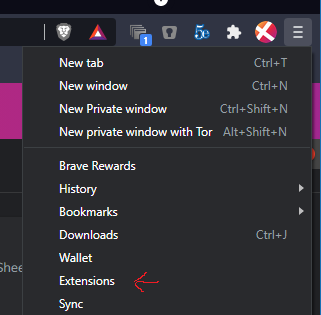
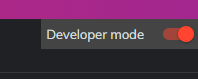
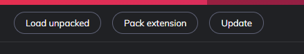
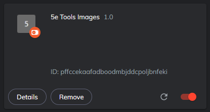
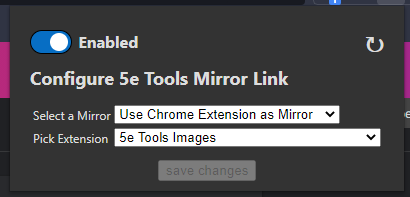

# How to Use Local Image Files

*NOTE: This currently will only work for Chromium based browsers (Chrome, Brave, Edge, etc.) and not for Firefox.*

If you have downloaded the massive repository of images for 5e Tools and wish to use the local reference, this will explain how.

**WARNING: Your local files are only accessible by you and not your fellow players/GMs**

## Why would you want this?

If you have a poorer internet connection, this can be a better/faster method of loading images as they come directly from your own computer instead of over the internet. This speeds up loading times and doesn't choke your bandwidth as much. have you ever opened the 5e Tools Compendium of monsters and had to wait while hundreds of images loaded? This helps to fix that.

## How Does This Work?

You start by downloading all of the images, then create a fake chrome extension in the directory of images. After that you can use that "extension" as the source of your images/

### Step 1. Download 5e Tools Images

- The images can be found either on the website itself [Get 5e Tools](https://get.5e.tools/), or can also be found in the fan [Discord for 5e Tools](https://discord.gg/nGvRCDs) under the `#5etools-general` channel. This zip is extremely large (over 3 GiB) so it may take a while to download.
- Once finished, extract the zip somewhere where you can keep it.

### Step 2. Create the Extension

- Go into the images directory you have extracted, and navigate to the directory that contains a folder called `img/`. This might be on the root, or it might be down a couple of levels.
- Next, in this folder create a file called `manifest.json`. Then in that file, copy and paste the following:

```json
{
  "name": "5e Tools Images",
  "version": "1.0",
  "manifest_version": 3,
  "web_accessible_resources": [
    {
      "resources": ["img/*"],
      "matches": ["*://*/*"],
      "use_dynamic_url": false
    }
  ]
}
```

- Save the file and close it.

### Step 3. Add the Extension to Your Browser

- Open your browser's extensions page. This is found in the browser's side menu.  

- In the upper-right corner you will see a toggle switch that says "Developer mode". Turn this ON  

- You will now see a button that says "Load unpacked". Click this button.  

- It will present a dialog asking you to select a folder. Navigate to the folder that contains your newly created `manifest.json` file and open that folder.
- You should now see a new extension called "5e Tools Images"  


### Step 4. Switch to the new Extension Mirror

- Open the config menu for Plutonium Mirror by clicking on it.
- Change the mirror selector to "Use Chrome Extension as Mirror"
- You will now see a new drop down selector that contains all of your installed extensions.
- Open it and select the "5e Tools Images" extension.
- Save Changes and you're done!


