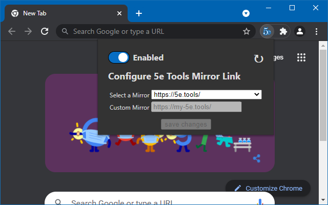

# Plutonium Mirror

[](https://github.com/flamewave000/plutonium-mirror/releases/latest)  


An Add-On for defining which Mirror to use for 5e Tools



[](https://patreon.com/dragonflagon)

## Chromium Browsers (Chrome, Brave, Edge, Vivaldi, Epic, Slim, Torch, Comodo)

For all Chromium based browsers, you can find the extension in the [~~Chrome Web Store~~ Currently Pending Review](#)  
Or you can install it manually using the following steps:

1. Download the `plutonium-mirror-X.X.zip` file from the [Latest Release](https://github.com/flamewave000/plutonium-mirror/releases/latest)
2. Open your browser's extensions page (ie. `chrome://extensions` or `brave://extensions`)
3. In the top right corner, toggle ON the "Developer mode" switch.
4. Drag+Drop the `plutonium-mirror-X.X.zip` file onto the extensions page.
5. Enjoy!

## Mozilla Firefox 

For Firefox browsers, you can find the extension in the [Firefox Add-On Store](https://addons.mozilla.org/en-CA/firefox/addon/plutonium-mirror/)  
Or you can install it manually using the following steps:

1. Download the `plutonium-mirror-X.X.xpi` file from the [Latest Release](https://github.com/flamewave000/plutonium-mirror/releases/latest)
2. Open your Firefox's "Add-Ons and Themes" page (ie. `about:addons`)
3. In the top right corner, toggle ON the "Developer mode" switch.
4. Drag+Drop the `plutonium-mirror-X.X.xpi` file onto the Add-Ons page.
5. Click "Add" on the prompt that appears.
6. Enjoy!

## How to Use Local Files

In order to use local files for your images, you have to be using a Chromium based browser (Chrome, Brave, Edge, Vivaldi, Epic, Slim, Torch, Comodo, etc.). This is due to Firefox's Add-On Signing restrictions which are basically just a huge PITA. To find out how to do this for chromium, go to the [How To Use Local](HowToUseLocal.md) guide.

## Download Statistics

 
v2.x   
v1.x 

## Mirror List

[](https://5etools-mirror-1.github.io)
[](https://thegiddylimit.github.io)
[](https://5e-tools.dragonflagon.cafe)
[](https://dnd5e.eclipseofbutterflies.ml)

## For Developers

This extension is designed to work in both Chromium and Firefox browsers using the exact same JavaScript/Manifest/HTML. Please adhere to this and make sure to test all changes in both browsers.

### Packaging Extensions

There is a `pak` script for bash to perform quick packing. For Chromium, this entails simply zipping the relevant files together. For Mozilla, this is running the `web-ext` tool to sign the package. Signing the package requires a Mozilla Account along with the relevant [API Credentials](https://addons.mozilla.org/en-US/developers/addon/api/key/) for your account. Please do not modify the `.web-extension-id` file as that is for my official version.

#### Install `web-ext`

`npm i -g web-ext`

#### Pack Chrome
Will package the relevant files into `plutonium-mirror.zip`. Requires the `zip` command: `sudo apt install zip`.

`./pak chrome`

#### Pack Mozilla
Will copy the project to a `.mozilla-build` directory and run the `web-ext` program.

`./pak mozilla "JWT Issuer" "JWT Secret"`

OR if you have your JWT creds in a local file called `.creds` (which is a git-ignored file), you do not need to provide them. Instead the build script will check for the file's existence and attempt to use it for the credentials.

`./pak mozilla`

The `.creds` file should be in the project's root directory and look like this:

```bash
jwt_issuer="user:########:##"
jwt_secret="1a2b3c....4d5e6f"
```

#### Pack All

Runs both the `chrome` and `mozilla` packagers

`./pak all ["JWT Issuer"] ["JWT Secret"]`  

### Important Links

- [Chrome Web Store Dev Console](https://chrome.google.com/webstore/devconsole)
- [Mozilla Add-Ons Dev Console](https://addons.mozilla.org/en-US/developers/addons)
